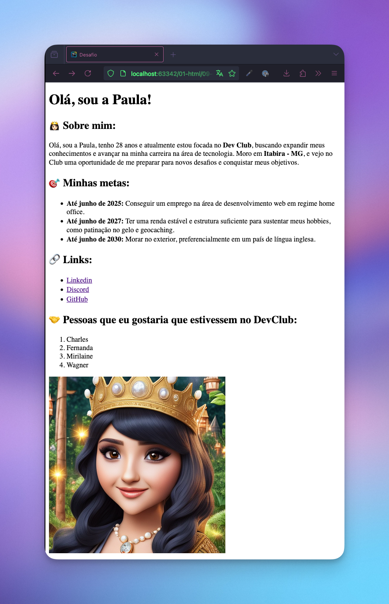

# Challenge 01: Desafio

This project is an **About Me page**, created as part of my learning journey in web development.  
The objective was to build a **personal profile page** to practice essential HTML concepts and provide
information about my contact methods and curiosities.

## 📸 Screenshots

## 🔗 Link

## 👷🏻‍♀️ Built with

## 👩🏻‍💻 Author

  

  

